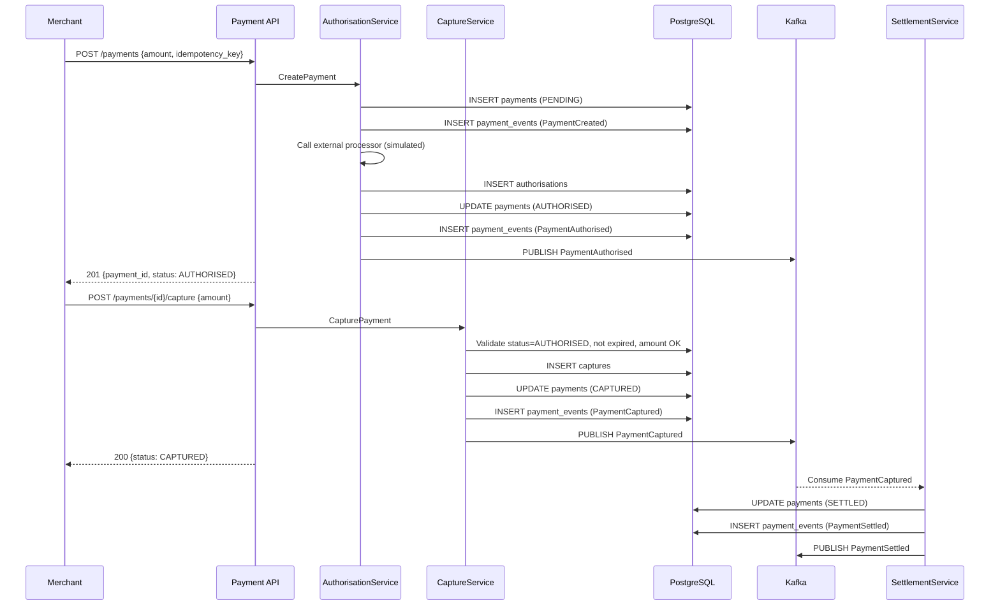
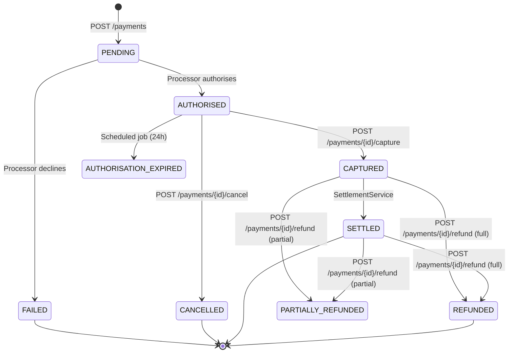
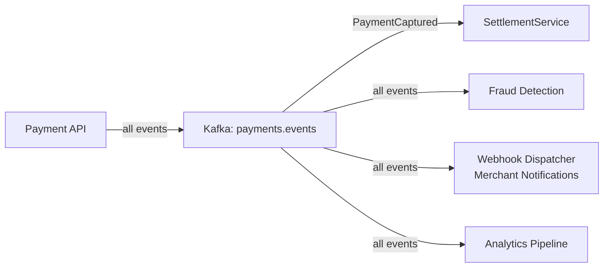

# Requirements — Payment Processing System

---

## Functional Requirements

**FR-01** — The system shall allow a merchant to create a payment by submitting an amount,
currency, customer reference, and idempotency key, receiving a payment ID in response.

**FR-02** — The system shall authorise a payment against a simulated external processor and
record the authorisation code, authorised amount, and expiry timestamp.

**FR-03** — The system shall allow a merchant to capture an authorised payment for an amount
up to and including the authorised amount.

**FR-04** — The system shall reject capture requests where the authorisation has expired.

**FR-05** — The system shall reject capture requests where the requested capture amount
exceeds the authorised amount.

**FR-06** — The system shall allow a merchant to refund a captured payment, in full or in
part, up to the total captured amount.

**FR-07** — The system shall allow a merchant to cancel a payment that has been authorised
but not yet captured.

**FR-08** — The system shall enforce the payment state machine: each state transition must
be valid from the current state; invalid transitions are rejected with a 422 error.

**FR-09** — The system shall record every state transition as an immutable entry in the
`payment_events` table, with a precise timestamp.

**FR-10** — The API must return the complete state and event history for any payment by ID.

**FR-11** — The system shall publish a Kafka event for every payment lifecycle transition
to the `payments.events` topic.

**FR-12** — The system shall process settlement of captured payments asynchronously via a
Kafka consumer, transitioning payments to SETTLED on success.

**FR-13** — The system shall process a payment operation exactly once when the same
idempotency key is submitted multiple times, returning the original result on duplicates.

---

## Non-Functional Requirements

### Availability

- **NFR-01** — The system shall maintain 99.9% uptime.
- **NFR-02** — The settlement pipeline may have a processing delay of up to 24 hours in
  degraded mode without violating the system's durability guarantees.

### Latency

- **NFR-03** — `POST /payments` (create + authorise) p99 ≤ 300ms.
- **NFR-04** — `POST /payments/{id}/capture` p99 ≤ 200ms.
- **NFR-05** — `GET /payments/{id}` p99 ≤ 50ms.

### Throughput

- **NFR-06** — The system shall sustain 200 TPS at peak load.
- **NFR-07** — The settlement pipeline shall process captured payments within 24 hours
  under normal operating conditions.

### Durability

- **NFR-08** — Zero tolerance for committed payment data loss. Any payment that has received
  a creation success response must be permanently recorded.
- **NFR-09** — The payment event log must be complete and uneditable. No event record may
  be deleted or modified after creation.

### Consistency

- **NFR-10** — Payment state transitions are strongly consistent. A read immediately after
  a transition must reflect the new state.
- **NFR-11** — An idempotency key submitted within its 24-hour TTL window must always
  return the same result, regardless of which API instance handles the request.

---

## Estimated Traffic.

| Metric                           | Estimate                                 |
| -------------------------------- | ---------------------------------------- |
| Transactions per day             | 50,000                                   |
| Peak transaction rate            | 200 TPS                                  |
| Payment events written per day   | ~250,000 (5 per payment avg)             |
| Kafka events per day             | ~250,000                                 |
| Active idempotency keys in Redis | ~4,320,000 (200 TPS × 86,400s × 24h TTL) |
| Refund rate (estimated 1%)       | ~500 refunds/day                         |
| Average payment payload size     | ~1KB                                     |

---

## Data Flow.

### Payment Lifecycle — Happy Path

### Payment State Machine

### Event Stream Flow

